# 🎮 PitchPerfectly Karaoke Arcade 🎤

> **Professional-grade karaoke with real-time vocal analysis, video playback, and retro arcade vibes**

A local, offline karaoke web application that combines YouTube-style karaoke videos with studio-quality vocal scoring. Upload any song pair, perform with live feedback, and compete on local leaderboards—all running entirely on your machine.

[](https://opensource.org/licenses/MIT)
[](https://nodejs.org/)
[](https://www.python.org/)
[](https://reactjs.org/)

---

## ✨ Features at a Glance

| Feature | Description |
|---------|-------------|
| 🎬 **Video Karaoke** | MP4/WebM playback with frame-accurate timing (`requestVideoFrameCallback`) |
| 🎵 **Advanced Audio** | Demucs v4 vocal separation + torch-crepe pitch tracking |
| 🎯 **Real-time Scoring** | 30% pitch + 70% energy with live visual feedback |
| 🔊 **Echo Cancellation** | NLMS adaptive filtering for speaker playback mode |
| 📊 **Performance Analytics** | Phrase-level breakdown with post-run DTW refinement |
| 🏆 **Local Leaderboard** | SQLite-based rankings with badge system |
| 🎮 **Retro UI** | Neon grid aesthetics with CRT shader effects |
| 🔒 **100% Private** | All processing happens locally—no cloud uploads |

---

## 🚀 Quick Start

### 🐳 Docker (Recommended)

The fastest way to get started—no dependencies required:

```bash
# Clone the repository
git clone <your-repo-url>
cd karaoke-arcade-skeleton

# CPU mode (works everywhere, including Mac)
./docker-start.sh

# GPU mode (Linux with NVIDIA GPU only - 4x faster preprocessing)
./docker-start-gpu.sh

# Open in browser
open http://localhost:8080
```

**Performance Notes**:
- **CPU mode**: Works on all platforms (Mac, Windows, Linux) - preprocessing takes 2-4 minutes per song
- **GPU mode**: Requires NVIDIA GPU + Linux - preprocessing takes 30-60 seconds per song (4x faster!)
- **AWS deployment**: See guides below for cloud GPU setup

### ☁️ Deploy to AWS (One Command!)

Deploy to AWS with GPU acceleration in one command:

```bash
# Configure AWS (one-time)
aws configure

# Deploy everything automatically
./deploy-aws-spot-complete.sh
```

This creates a complete AWS infrastructure with:
- ✅ g4dn.xlarge Spot instance (70% cheaper!)
- ✅ GPU acceleration (4x faster preprocessing)
- ✅ Your songs uploaded to EFS
- ✅ Auto-scaling and monitoring
- ✅ ~$130-150/month (or $0 when stopped)

See [AWS-DEPLOYMENT-SIMPLE.md](AWS-DEPLOYMENT-SIMPLE.md) for the complete guide.

### 💻 Native Installation

For optimal performance with GPU acceleration:

#### Prerequisites
- **Node.js 20+** ([Download](https://nodejs.org/))
- **Python 3.10+** ([Download](https://www.python.org/))
- **FFmpeg** (`brew install ffmpeg` on macOS)
- **macOS 12.3+** (for Apple Silicon MPS acceleration)

#### Installation Steps

```bash
# 1. Backend setup
cd backend
npm install

# 2. Frontend setup
cd ../frontend
npm install

# 3. Python environment
cd ../python
python3 -m venv .venv
source .venv/bin/activate  # On Windows: .venv\Scripts\activate
pip install -r requirements.txt

# 4. Start the application
cd ../backend
node server.js
```

Open **http://localhost:8080** in your browser and start singing! 🎤

📖 **Detailed setup guide**: See [QUICKSTART.md](QUICKSTART.md)

---

## How It Works

### System Architecture Flow

```mermaid
%%{init: {'theme':'dark', 'themeVariables': { 'primaryColor':'#ff00ff','primaryTextColor':'#00ff00','primaryBorderColor':'#00ff00','lineColor':'#ff00ff','secondaryColor':'#1a1a2e','tertiaryColor':'#0f3460','background':'#0a0a0f','mainBkg':'#1a1a2e','secondaryBkg':'#0f3460','tertiaryBkg':'#16213e','textColor':'#00ff00','fontSize':'18px','fontFamily':'Courier New'}}}%%

graph TB

    %% Styling
    classDef frontend fill:#ff00ff,stroke:#00ff00,stroke-width:3px,color:#000000
    classDef backend fill:#00ff00,stroke:#ff00ff,stroke-width:3px,color:#000000
    classDef python fill:#0ff,stroke:#f0f,stroke-width:3px,color:#000000
    classDef storage fill:#f0f,stroke:#0ff,stroke-width:3px,color:#000000
    classDef realtime fill:#ffff00,stroke:#ff00ff,stroke-width:4px,color:#000000

    %% UPLOAD & PREPROCESSING FLOW
    subgraph UPLOAD["🎮 SONG UPLOAD FLOW"]
        U1[User Selects<br/>Karaoke Video +<br/>Original Audio<br/><b>React + Fetch API</b>]:::frontend
        U2[Multer Upload<br/>500MB limit<br/><b>Express + Multer</b>]:::backend
        U3[Save to<br/>/songs/UUID/<br/><b>Node.js fs + UUID</b>]:::storage
        U4[Create DB Record<br/>status: pending<br/><b>SQLite3</b>]:::storage

        U1 -->|POST /songs/upload| U2
        U2 --> U3
        U3 --> U4
    end

    subgraph PREPROCESS["⚡ PYTHON PREPROCESSING"]
        P1[Spawn Python<br/>preprocess_full.py<br/><b>child_process.spawn</b>]:::backend
        P2[Extract Audio<br/>from Video<br/><b>PyAV + FFmpeg</b>]:::python
        P3[Demucs v4<br/>Vocal Separation<br/><b>PyTorch + Demucs</b><br/><b>htdemucs_ft model</b>]:::python
        P4[DTW Alignment<br/>Chroma Features<br/><b>librosa + dtaidistance</b>]:::python
        P5[torch-crepe<br/>Pitch Extraction<br/><b>CREPE full model</b><br/><b>PyTorch</b>]:::python
        P6[Generate<br/>reference.json<br/><b>NumPy + SciPy</b><br/><b>JSON schema v2.0</b>]:::python
        P7[Update DB<br/>status: complete<br/><b>SQLite3</b>]:::storage

        P1 --> P2
        P2 --> P3
        P3 --> P4
        P4 --> P5
        P5 --> P6
        P6 --> P7
    end

    U4 --> P1

    %% PERFORMANCE FLOW
    subgraph SETUP["🎤 PERFORMANCE SETUP"]
        S1[User Selects Song<br/>from Library<br/><b>React State</b>]:::frontend
        S2[Load Song Data<br/>GET /library/:id<br/><b>Express + SQLite3</b>]:::backend
        S3[Mic Check Screen<br/>Test Audio Levels<br/><b>Web Audio API</b><br/><b>getUserMedia</b>]:::frontend
        S4[Create Session<br/>POST /sessions/start<br/><b>Express + UUID</b>]:::backend

        S1 --> S2
        S2 --> S3
        S3 --> S4
    end

    P7 -.->|Song Ready| S1

    subgraph REALTIME["💫 REAL-TIME PERFORMANCE"]
        R1[Video Playback<br/>requestVideoFrameCallback<br/>HTTP Range Requests]:::realtime
        R2[AudioWorklet<br/>pitch-processor-aec.js]:::realtime
        R3[YIN Pitch Detection<br/>80-1000 Hz<br/>2048 samples]:::realtime
        R4[NLMS Echo Cancel<br/>512-tap filter<br/>0.01 learning rate]:::realtime
        R5[RMS Energy Calc<br/>User-Relative<br/>Log Normalization]:::realtime
        R6[LiveHUD Scoring<br/>30% Pitch<br/>70% Energy]:::realtime
        R7[Visual Feedback<br/>Note Lane<br/>Combo Counter<br/>Beat LEDs]:::realtime

        R1 --> R2
        R2 --> R3
        R2 --> R4
        R2 --> R5
        R3 --> R6
        R4 --> R6
        R5 --> R6
        R6 --> R7
    end

    S4 --> R1

    %% SCORING ALGORITHMS
    subgraph SCORING["🎯 SCORING ENGINE"]
        SC1[Pitch Accuracy<br/>Exponential Decay<br/>±50¢ = 95-100%<br/>Floor: 15%]:::realtime
        SC2[Key-Shift Forgive<br/>Median Offset<br/>Octave Tolerance]:::realtime
        SC3[Energy Matching<br/>Dynamic Range<br/>10% Floor]:::realtime
        SC4[Combo Tracking<br/>80% threshold<br/>5+ for display]:::realtime
        SC5[Continuous Score<br/>No Step Functions<br/>10k sample limit]:::realtime

        R6 --> SC1
        R6 --> SC2
        R6 --> SC3
        R6 --> SC4
        SC1 --> SC5
        SC2 --> SC5
        SC3 --> SC5
        SC4 --> SC5
    end

    %% RESULTS FLOW
    subgraph RESULTS["📊 RESULTS & LEADERBOARD"]
        RS1[Save Performance<br/>POST /sessions/:id/finish]:::backend
        RS2[Calculate Badges<br/>Combo King<br/>Mic Melter<br/>Smooth Operator]:::backend
        RS3[Display Results<br/>Score Breakdown<br/>Phrase Analysis]:::frontend
        RS4[Optional Refine<br/>Phrase-level DTW<br/>refine_results.py]:::python
        RS5[Submit to Leaderboard<br/>POST /leaderboard/submit]:::backend
        RS6[Rankings Display<br/>Top 20 Scores]:::frontend

        RS1 --> RS2
        RS2 --> RS3
        RS3 -->|User Choice| RS4
        RS3 -->|Player Name| RS5
        RS4 --> RS3
        RS5 --> RS6
    end

    SC5 --> RS1

    %% STORAGE LAYER
    subgraph DATABASE["💾 STORAGE"]
        DB1[(SQLite DB<br/>karaoke.db<br/>songs/sessions/<br/>leaderboard)]:::storage
        DB2[(/songs/UUID/<br/>karaoke.mp4<br/>original_audio.wav<br/>vocals.wav<br/>reference.json)]:::storage
        DB3[(/sessions/UUID/<br/>performance.json<br/>refined.json)]:::storage

        DB1 -.-> DB2
        DB1 -.-> DB3
    end

    U3 -.-> DB2
    P7 -.-> DB1
    RS1 -.-> DB1
    RS1 -.-> DB3
    RS5 -.-> DB1

    %% LEGEND
    subgraph LEGEND["🕹️ COMPONENT TYPES"]
        L1[Frontend React]:::frontend
        L2[Backend Express]:::backend
        L3[Python Processing]:::python
        L4[Storage/DB]:::storage
        L5[Real-Time Audio]:::realtime
    end
```



### The Journey of a Song

1. **📤 Upload**: User selects karaoke video (with lyrics) + original studio audio
2. **⚡ Preprocessing** (90-180 seconds):
   - Extract audio from video using FFmpeg
   - Separate vocals from original using Demucs v4
   - Align karaoke and reference timelines with DTW
   - Extract pitch contour using torch-crepe
   - Generate comprehensive reference.json
3. **🎵 Performance**:
   - Video plays with frame-accurate timing
   - Microphone captures your voice
   - AudioWorklet processes audio in real-time
   - Live HUD displays pitch accuracy, energy, combos
4. **📊 Results**:
   - Detailed breakdown with phrase-level analysis
   - Badge awards (Combo King, Mic Melter, Smooth Operator)
   - Optional post-run refinement for improved accuracy
   - Leaderboard submission with player name

---

## 🎯 Scoring System Deep Dive

### Real-Time Scoring Algorithm

PitchPerfectly uses a sophisticated continuous scoring system with no arbitrary thresholds:

#### **Pitch Accuracy (30% weight)**

```
Score = floor + (1 - floor) × exp(-|cents_error| / decay_rate)

Where:
  - cents_error = 1200 × log₂(detected_f0 / reference_f0)
  - decay_rate = 220 cents (controls forgiveness)
  - floor = 15% (minimum score)
```

**Accuracy Ranges**:
- **±50 cents** → 95-100% (Perfect)
- **±100 cents** → 80-95% (Good)
- **±200 cents** → 40-80% (Acceptable)
- **>±200 cents** → Exponential decay to 15% floor

**Key-Shift Forgiveness**: Detects sustained octave errors and applies automatic correction (±100-200 cents tolerance).

#### **Energy Matching (70% weight)**

User-relative logarithmic normalization—adapts to YOUR singing style:

```
normalized_energy = (log₁₀(RMS) - log₁₀(min)) / (log₁₀(max) - log₁₀(min))

With:
  - Dynamic range tracking during performance
  - Smooth tanh clamping to prevent extremes
  - 10% minimum floor for silent sections
  - Quiet boost for very soft singing
```

**Why user-relative?** Because everyone sings at different volumes. The system learns your range and scores you accordingly.

#### **Combo System**

- **Activation**: 5+ consecutive accurate samples (≥80% total score)
- **Break**: Score drops below 40%
- **Display**: Bold yellow counter when active
- **Badge**: 50+ max combo earns "Combo King" 👑

### Visual Feedback (Live HUD)

The real-time heads-up display shows:

| Element | Description |
|---------|-------------|
| **Note Lane** | Piano roll-style pitch visualization with reference line |
| **Cents Error Bar** | Live accuracy indicator (±50 cents range) |
| **Beat LEDs** | 8 LEDs synchronized to tempo (downbeats highlighted) |
| **Combo Counter** | Streak display for sustained accuracy |
| **Score Display** | Real-time percentage with smooth animations |

### Badge System

Earn achievements based on your performance:

| Badge | Requirement | Icon |
|-------|-------------|------|
| **Smooth Operator** | 95%+ pitch accuracy | 🎵 |
| **Mic Melter** | 90%+ energy matching | 🔥 |
| **Combo King** | 50+ max combo streak | 👑 |
| **On-Beat Bandit** | Perfect rhythm (future) | 🥁 |

---

## Technical Architecture

### Technology Stack

#### Frontend (React 18.2 + Vite 4.4)
- **VideoKaraokePlayer.jsx**: Frame-accurate playback with `requestVideoFrameCallback`
- **LiveHUD.jsx**: Real-time scoring engine with Canvas rendering
- **pitch-processor-aec.js**: AudioWorklet with YIN pitch detection + NLMS echo cancellation
- **SongLibrary.jsx**: Song browser with metadata display
- **ResultsScreen.jsx**: Performance analytics with SVG visualizations

#### Backend (Node.js 20 + Express 4.18)
- **server.js**: REST API with Multer file uploads (500MB limit)
- **SQLite3**: Database for songs, sessions, leaderboard
- **HTTP Range Support**: Efficient video streaming (206 Partial Content)
- **Child Process Management**: Python preprocessing queue

#### Python Processing (3.10+ with PyTorch)
- **separate.py**: Demucs v4 vocal separation (htdemucs_ft model)
- **preprocess_full.py**: Full pipeline (DTW + pitch extraction + reference generation)
- **refine_results.py**: Post-performance phrase-level DTW refinement

#### Key Libraries
- **Demucs v4**: State-of-the-art vocal separation (Meta Research)
- **torch-crepe**: High-quality pitch tracking with GPU acceleration
- **librosa**: Music information retrieval (chroma features, beat tracking)
- **dtaidistance**: Fast DTW implementation with Sakoe-Chiba band
- **PyAV**: FFmpeg Python bindings for video processing

### Project Structure

```
karaoke-arcade-skeleton/
├── backend/
│   ├── server.js              # Express API server (1030 lines)
│   ├── karaoke.db             # SQLite database
│   └── package.json           # Node dependencies
├── frontend/
│   ├── src/
│   │   ├── App.jsx            # Main application (screen state management)
│   │   ├── components/
│   │   │   ├── VideoKaraokePlayer.jsx  # Video playback (461 lines)
│   │   │   ├── LiveHUD.jsx             # Scoring engine (1247 lines)
│   │   │   ├── SongLibrary.jsx         # Song browser (138 lines)
│   │   │   ├── MicCheck.jsx            # Audio setup (254 lines)
│   │   │   ├── ResultsScreen.jsx       # Analytics (336 lines)
│   │   │   └── Leaderboard.jsx         # Rankings (150 lines)
│   │   └── styles/
│   │       ├── retro.css               # Neon arcade theme
│   │       └── video-karaoke.css       # HUD-specific styles
│   ├── public/
│   │   └── workers/
│   │       └── pitch-processor-aec.js  # AudioWorklet (282 lines)
│   └── package.json           # React dependencies
├── python/
│   ├── separate.py            # Demucs v4 separation (248 lines)
│   ├── preprocess_full.py     # Full pipeline (886 lines)
│   ├── refine_results.py      # Post-run DTW (289 lines)
│   └── requirements.txt       # Python dependencies
├── songs/<uuid>/              # Processed song assets
│   ├── karaoke.mp4            # Original karaoke video
│   ├── original_audio.wav     # Studio reference audio
│   ├── karaoke_audio.wav      # Extracted karaoke audio
│   ├── vocals.wav             # Separated vocal track
│   ├── accompaniment.wav      # Instrumental track
│   └── reference.json         # Comprehensive scoring data (v2.0 schema)
├── sessions/<uuid>/           # Performance records
│   ├── performance.json       # Raw performance data
│   └── refined.json           # Post-processed results
├── demo_tracks/               # Sample content (14 songs)
├── assets/badges/             # SVG badge graphics
├── schemas/
│   └── reference.schema.json  # Reference data schema (251 lines)
├── docker-compose.yml         # Production container orchestration
├── docker-compose.dev.yml     # Development with hot-reloading
├── Dockerfile                 # Multi-stage build
├── start.sh                   # Native startup script
├── context.md                 # Complete project documentation (907 lines)
├── QUICKSTART.md              # User setup guide
└── README.md                  # This file
```

---

## 🔧 Configuration & Customization

### Scoring Weights

Edit `frontend/src/components/LiveHUD.jsx`:

```javascript
const SCORING_CONFIG = {
  PITCH_WEIGHT: 0.30,           // 30% pitch accuracy
  ENERGY_WEIGHT: 0.70,          // 70% energy matching

  // Pitch accuracy parameters
  PITCH_DECAY_RATE: 220,        // Cents error decay (higher = more forgiving)
  PITCH_FLOOR: 0.15,            // Minimum pitch score (15%)

  // Energy matching parameters
  ENERGY_FLOOR: 0.10,           // Minimum energy score (10%)

  // Combo system
  COMBO_MAINTAIN_THRESHOLD: 0.80,  // 80% to maintain combo
  COMBO_BREAK_THRESHOLD: 0.40,     // <40% breaks combo
  COMBO_DISPLAY_MIN: 5,            // Show combo at 5+
};
```

### Echo Cancellation (NLMS)

Adjust in `frontend/public/workers/pitch-processor-aec.js`:

```javascript
this.aecFilterLength = 512;      // Filter taps (higher = better but slower)
this.aecStepSize = 0.01;         // Learning rate (0.001-0.1)
this.aecRegularization = 0.001;  // Prevents division by zero
```

### Preprocessing Pipeline

Configure in `python/preprocess_full.py`:

```python
class PreprocessorConfig:
    SAMPLE_RATE = 48000              # Audio sample rate (Hz)
    HOP_LENGTH = 1024                # ~21ms frame size at 48kHz
    CREPE_MODEL = 'full'             # Pitch model (tiny/small/medium/large/full)
    CREPE_STEP_SIZE = 20             # 20ms step size
    DTW_BAND_WIDTH = 0.1             # Sakoe-Chiba band (10% of sequence)
    NOTE_TOLERANCE_CENTS = 40        # Note binning tolerance
    MIN_NOTE_DURATION = 0.2          # Minimum note duration (seconds)
    PITCH_CONF_THRESHOLD = 0.3       # Minimum pitch confidence
    REF_FPS = 50                     # Reference data frame rate (50 Hz)
```

---

## Troubleshooting

### Common Issues

#### ❌ "Preprocessing failed"

**Symptoms**: Upload completes but song never becomes "READY"

**Solutions**:
```bash
# 1. Check backend logs
cd backend
tail -f server.log

# 2. Verify Python environment
cd ../python
source .venv/bin/activate
python -c "import torch, demucs, torchcrepe; print('All imports OK')"

# 3. Test preprocessing manually
python preprocess_full.py \
  --song-id test-song \
  --karaoke-video ../demo_tracks/CallMeMaybe/callmemaybe.mp4 \
  --original-audio ../demo_tracks/CallMeMaybe/Carly\ Rae\ Jepsen\ -\ Call\ Me\ Maybe\ \(Lyrics\).mp3 \
  --output-dir ../songs/test-song

# 4. Check disk space
df -h .
```

#### ❌ "Echo cancellation not working"

**Symptoms**: Karaoke playback bleeds into microphone input

**Solutions**:
- **Use headphones** (bypasses echo cancellation entirely)
- Reduce karaoke volume to 30-50%
- Increase microphone distance from speakers
- Adjust AEC learning rate (try 0.005 or 0.02)

**Note**: Current implementation has AEC filter but reference signal not fully wired. Headphones recommended.

#### ❌ "Video playback stuttering"

**Symptoms**: Choppy video or audio desync

**Solutions**:
```bash
# 1. Re-encode video to lower bitrate
ffmpeg -i input.mp4 -b:v 2M -c:a copy output.mp4

# 2. Convert to MP4 if using WebM
ffmpeg -i input.webm -c:v libx264 -preset fast output.mp4

# 3. Close other applications
# 4. Check CPU usage (Activity Monitor / Task Manager)
```

#### ❌ "Alignment quality low" (<0.7)

**Symptoms**: reference.json shows `warp_T.quality < 0.7`

**Solutions**:
- Verify karaoke and original are **same song/key**
- Check if tempo is significantly different
- Try increasing DTW band width to 0.2 in `PreprocessorConfig`
- Listen to `vocals.wav` to verify separation quality

#### ❌ "Microphone access denied"

**Symptoms**: Mic Check screen shows permission error

**Solutions**:
- **Chrome/Edge**: Settings → Privacy → Microphone → Allow
- **Safari**: Preferences → Websites → Microphone → Allow
- **Firefox**: about:preferences → Privacy → Permissions → Microphone
- Ensure using **HTTPS** or **localhost** (required for getUserMedia)

### Performance Benchmarks

| Task | Apple Silicon (MPS) | NVIDIA GPU (Docker) | Intel CPU | Docker (CPU) |
|------|---------------------|---------------------|-----------|--------------|
| Vocal separation (3min) | 15-30s | 15-30s | 45-90s | 60-120s |
| DTW alignment | ~5s | ~5s | ~5s | ~5s |
| Pitch extraction | ~8s | ~6s | ~15s | ~12s |
| **Total preprocessing** | **30-45s** | **30-60s** | **90-180s** | **120-240s** |
| Real-time scoring latency | <10ms | <10ms | <10ms | <10ms |

**GPU Recommendations:**
- **Development/Testing**: NVIDIA T4 (AWS g4dn.xlarge) - ~$0.53/hour
- **Production**: NVIDIA A10G (AWS g5.xlarge) - ~$1.00/hour
- See [GPU-DEPLOYMENT.md](GPU-DEPLOYMENT.md) for detailed setup and benchmarks

---

## 🎵 Best Practices

### Preparing Songs

1. **Karaoke Video**:
   - Download from YouTube using `yt-dlp`
   - 1080p resolution recommended (720p minimum)
   - MP4 format preferred (better browser compatibility)
   - Ensure lyrics are baked into video

2. **Original Audio**:
   - Studio version (not live recordings)
   - WAV format preferred (MP3 320kbps acceptable)
   - **Must be same key and tempo as karaoke video**
   - Verify sync by playing side-by-side before upload

3. **Verification Checklist**:
   - [ ] Both files play correctly
   - [ ] Same song, same key, same tempo
   - [ ] Karaoke video has visible lyrics
   - [ ] Original audio is clear (no distortion)
   - [ ] Sufficient disk space (1GB+ free)

### Recording Setup

| Component | Recommendation |
|-----------|----------------|
| **Microphone** | External USB mic (Blue Yeti, Audio-Technica AT2020) |
| **Fallback** | Built-in Mac mic works but lower quality |
| **Distance** | 6-12 inches from mouth |
| **Environment** | Quiet room, minimal background noise |
| **Volume** | Medium (50-70%) to reduce echo issues |
| **Monitoring** | Headphones strongly recommended |

### Singing Tips

- 🎤 **Warm up your voice** before performing
- 🎵 **Stay close to reference pitch** (avoid octave jumps unless intentional)
- 🥁 **Follow beat indicators** (8 LEDs on HUD)
- 📊 **Maintain consistent volume** (energy matching is 70% of score)
- 🎯 **Watch the note lane** for real-time pitch feedback
- 🔥 **Build combos** by sustaining accuracy (5+ for display)

---

## 📚 API Reference

### REST Endpoints

#### Song Management

| Endpoint | Method | Description | Input | Output |
|----------|--------|-------------|-------|--------|
| `/songs/upload` | POST | Upload karaoke video + original audio | `multipart/form-data` with `karaoke_video`, `original_audio`, `song_name` | `{song_id, status: "processing"}` |
| `/songs/:id/status` | GET | Check preprocessing progress | - | `{status, progress, error?}` |
| `/library` | GET | List ready songs | - | Array of song metadata |
| `/library/:id` | GET | Get detailed song data | - | Song object with `reference_data` |

#### Media Streaming

| Endpoint | Method | Description | Headers |
|----------|--------|-------------|---------|
| `/video/:song_id/:filename` | GET | Stream video with range support | `Range: bytes=0-1023` |
| `/audio/:song_id/:filename` | GET | Stream audio file | - |

#### Session Management

| Endpoint | Method | Description | Input | Output |
|----------|--------|-------------|-------|--------|
| `/sessions/start` | POST | Create new performance session | `{song_id}` | `{session_id}` |
| `/sessions/:id/finish` | POST | Save performance results | Performance data object | `{ok: true}` |
| `/sessions/:id/refine` | POST | Trigger post-run DTW refinement | - | `{ok: true, refined: {...}}` |
| `/sessions/:id/results` | GET | Retrieve session results | - | `{results, refined?}` |

#### Leaderboard

| Endpoint | Method | Description | Input | Output |
|----------|--------|-------------|-------|--------|
| `/leaderboard/submit` | POST | Submit score to leaderboard | `{session_id, player_name, scores, badges}` | `{ok: true}` |
| `/leaderboard` | GET | Get high scores | `?limit=10` (max 20) | Array of ranked performances |

### Data Schemas

#### Reference Data (reference.json v2.0)

```json
{
  "version": "2.0",
  "song_id": "uuid",
  "duration": 180.5,
  "warp_T": {
    "segments": [
      {"t_k_start": 0, "t_k_end": 10, "a": 1.02, "b": -0.5, "quality": 0.95}
    ],
    "quality": 0.92
  },
  "f0_ref_on_k": [
    {"t_k": 0.0, "f0": 440.0, "conf": 0.95},
    {"t_k": 0.02, "f0": 442.0, "conf": 0.97}
  ],
  "note_bins": [
    {"t_k_start": 0.0, "t_k_end": 1.5, "f0_median": 440.0, "note_name": "A4"}
  ],
  "beats": [0.5, 1.0, 1.5, 2.0],
  "downbeats": [0.5, 2.5, 4.5],
  "phrases": [
    {"t_k_start": 0.0, "t_k_end": 10.0, "phrase_id": 0}
  ],
  "loudness_profile": [
    {"t_k": 0.0, "loudness_db": -20.0}
  ],
  "key": "C major",
  "tempo_bpm": 120.0
}
```

#### Performance Data (performance.json)

```json
{
  "session_id": "uuid",
  "song_id": "uuid",
  "timestamp": "2025-12-03T12:00:00Z",
  "samples": [
    {
      "time": 0.0,
      "detected_f0": 440.0,
      "reference_f0": 442.0,
      "cents_error": -7.8,
      "pitch_score": 0.95,
      "energy": 0.75,
      "energy_score": 0.88,
      "total_score": 0.90
    }
  ],
  "overall_scores": {
    "pitch_accuracy": 0.92,
    "energy_matching": 0.85,
    "total_score": 0.87,
    "max_combo": 45
  },
  "badges": ["combo_king", "smooth_operator"]
}
```

---

## 🔒 Privacy & Security

PitchPerfectly is designed with privacy as a core principle:

-  **100% Local Processing**: All audio analysis happens on your machine
-  **No Cloud Uploads**: Files never leave your computer
-  **No Analytics**: No tracking, telemetry, or usage data collection
-  **Explicit Permissions**: Microphone access requires user consent
-  **Local Storage Only**: SQLite database stored in `backend/karaoke.db`
-  **Open Source**: Full code transparency (MIT License)

**Data Retention**: All performance data stored locally. Delete `backend/karaoke.db` and `sessions/` directory to remove all records.

---

## 🚀 Development

### Development Mode (Docker)

For active development with hot-reloading:

```bash
# Start development environment
./docker-dev.sh

# Or manually
docker-compose -f docker-compose.dev.yml up

# Frontend: http://localhost:3000 (Vite dev server with HMR)
# Backend: http://localhost:8080 (auto-restart on changes)
```

**Features**:
-  Source code mounted as volumes (edit locally, see changes instantly)
-  Frontend hot-reloads on save
-  Backend auto-restarts on file changes
-  Separate containers for frontend/backend
-  All data persists (songs, database, sessions)

**Useful commands**:
```bash
# View logs
docker-compose -f docker-compose.dev.yml logs -f

# View backend logs only
docker-compose -f docker-compose.dev.yml logs -f backend

# Stop development environment
docker-compose -f docker-compose.dev.yml down

# Rebuild after dependency changes
docker-compose -f docker-compose.dev.yml up --build
```

### Native Development

```bash
# Terminal 1: Backend
cd backend
node server.js

# Terminal 2: Frontend (development mode)
cd frontend
npm run dev
# Opens http://localhost:3000 with hot-reloading

# Terminal 3: Python (for manual testing)
cd python
source .venv/bin/activate
python preprocess_full.py --help
```

### Building for Production

```bash
# Build frontend
cd frontend
npm run build
# Output: frontend/dist/

# Backend serves built frontend automatically
cd ../backend
node server.js
# Open http://localhost:8080
```

### GPU-Accelerated Deployment

For production deployments with GPU acceleration (AWS, on-premise):

```bash
# AWS ECS deployment
docker build -t karaoke-arcade .
docker tag karaoke-arcade:latest <account-id>.dkr.ecr.us-east-1.amazonaws.com/karaoke-arcade:latest
docker push <account-id>.dkr.ecr.us-east-1.amazonaws.com/karaoke-arcade:latest

# Deploy to ECS with GPU support (see GPU-DEPLOYMENT.md for full guide)
```

**GPU Benefits:**
- ✅ 4x faster preprocessing (30-60s vs 120-240s per song)
- ✅ Better user experience for song uploads
- ✅ Cost-effective for high-volume usage
- ✅ Automatic CPU fallback if GPU unavailable

📖 **Complete GPU Setup Guide**: [GPU-DEPLOYMENT.md](GPU-DEPLOYMENT.md)

---

## 📈 Roadmap

### ✅ Completed (Current Version)
- [x] Video karaoke playback with frame-accurate timing
- [x] Demucs v4 vocal separation
- [x] DTW alignment for sync handling
- [x] torch-crepe pitch extraction
- [x] Real-time scoring with AudioWorklet
- [x] NLMS echo cancellation (filter implemented, wiring in progress)
- [x] Live HUD with visual feedback
- [x] Local leaderboard with badge system
- [x] Retro arcade UI with neon aesthetics
- [x] Docker support (production + development)
- [x] Comprehensive documentation

### 🔄 In Progress
- [ ] Complete AEC reference signal wiring
- [ ] Mobile responsive design
- [ ] Unit and integration tests
- [ ] Error recovery and fallback mechanisms

### 🔮 Future Enhancements

#### Short-Term
- [ ] Difficulty levels (Easy/Normal/Hard)
- [ ] Genre-specific tuning (Rock/Pop/Opera/R&B)
- [ ] Custom themes (Cyberpunk, Retro Wave, Classic Arcade)
- [ ] Performance optimizer for older hardware
- [ ] Song pack import/export

#### Medium-Term
- [ ] Multiplayer duet mode (split-screen)
- [ ] AI performance coach (real-time tips)
- [ ] Vocal effects (reverb, pitch correction)
- [ ] Recording export (save performances as audio/video)
- [ ] Advanced analytics (vibrato detection, breath control)

#### Long-Term
- [ ] Cloud sync (optional Firebase integration)
- [ ] Social features (share recordings, challenges)
- [ ] iOS/Android native apps
- [ ] VR karaoke experience (Meta Quest, Vision Pro)
- [ ] Song pack marketplace
- [ ] Live streaming integration (Twitch, YouTube)

---

## 🎉 Credits & Acknowledgments

### Technology Stack

**Core Libraries**:
- [Demucs v4](https://github.com/facebookresearch/demucs) - Meta Research (vocal separation)
- [torch-crepe](https://github.com/maxrmorrison/torchcrepe) - Max Morrison (pitch tracking)
- [librosa](https://librosa.org/) - AudioLab (music analysis)
- [dtaidistance](https://github.com/wannesm/dtaidistance) - Wannes Meert (DTW)
- [PyTorch](https://pytorch.org/) - Meta (deep learning framework)
- [React](https://react.dev/) - Meta (frontend framework)
- [Express](https://expressjs.com/) - OpenJS Foundation (backend framework)

**Inspirations**:
- 🎤 **Smule** - Mobile karaoke innovation
- 🎸 **Rocksmith** - Real-time music scoring
- 🎮 **Clone Hero** - Note highway visualization
- 🕹️ **Arcade Games** - Retro aesthetic and feedback systems

### Contributing

Contributions are welcome! Please see [CONTRIBUTING.md](CONTRIBUTING.md) for guidelines.

**Areas needing help**:
- 🧪 Unit and integration tests
- 📱 Mobile responsive design
- 🌐 Internationalization (i18n)
- 🎨 Additional themes and visual effects
- 📚 Documentation improvements

---

## 📄 License

MIT License - see [LICENSE](LICENSE) file for details.

**TL;DR**: Free to use, modify, and distribute. No warranty provided.

---

## 📖 Additional Documentation

- **[QUICKSTART.md](QUICKSTART.md)** - User-friendly setup guide with troubleshooting
- **[context.md](context.md)** - Complete project context (907 lines of technical detail)
- **[schemas/reference.schema.json](schemas/reference.schema.json)** - Reference data schema (v2.0)

---

## 🎤 Start Singing Today!

```bash
# Quick start (Docker)
./docker-start.sh
open http://localhost:8080

# Or native installation
cd backend && npm install
cd ../frontend && npm install
cd ../python && pip install -r requirements.txt
cd ../backend && node server.js
```

**🎮 Built with ❤️ for karaoke enthusiasts! Let's make some noise! ✨**

---

<div align="center">

**Questions? Issues? Feedback?**

[Open an Issue](https://github.com/your-repo/issues) | [Discussions](https://github.com/your-repo/discussions) | [Wiki](https://github.com/your-repo/wiki)

</div>
